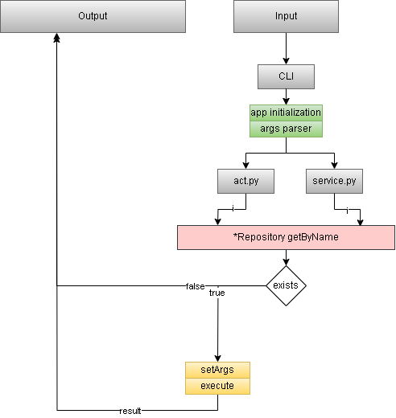

## Prethmeta

Python app/framework for creating collections with content

Look at [docs](docs/ru/README.md)

## Задачи:

- [ ] Web crawler: полное переписывание, режим archive.is
- [ ] Web.crawler: Возможность для определённого сайта запускать определённые инструкции
- [ ] Экспорт: exportToZip
- [ ] Экспорт: importFromZip
- [ ] Метаданные: получение дополнительных метаданных
- [ ] Vk: подписка на стену
- [ ] Pre-execute
- [ ] Файловая система: подмена даты создания файла
- [ ] Инициализация: адаптация под bash
- [ ] Executable: хуки выполнения
- [ ] Db: indexation_content_string в генерируемую колонку
- [ ] Db: выбор типа подключения
- [ ] Превью: переписать под state
