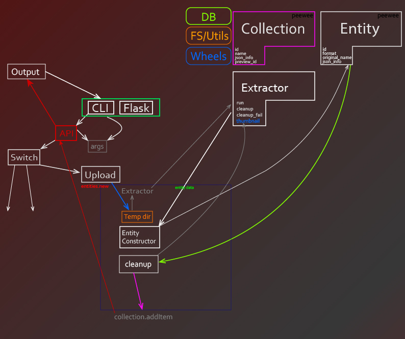

## Difault

Pythonical app for creating virtual collections with internet content

Wt. [docs](docs/ru/README.md)
<!---->

Tasks:

- [ ] Переписать web crawler
- [ ] Web.crawler: переписать работу как на archive.is (убирать js)
- [ ] Web.crawler: Возможность для определённого сайта запускать определённые инструкции
- [ ] exportToZip
- [ ] importFromZip
- [ ] Получение дополнительных метаданных из медиафайлов
- [ ] Vk.video HLS
- [ ] Vk.audio HLS
- [ ] Vk.poll скачивание фона
- [ ] Vk.link скачивание картинки
- [ ] Переписать Services с сохранением в db; запускать отдельным процессом
- [ ] Service RSS
- [ ] Service подписка на стену вк
- [ ] Параллельная загрузка
- [ ] Защита от рекурсии
- [ ] Pre-execute
- [ ] Перерисовать схему
- [ ] Подмена "created_at" у файла на тот что в таблице
