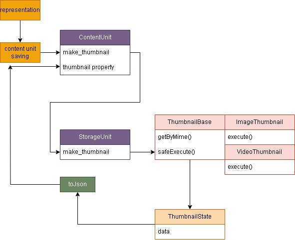

### Превью

Превью создаются с помощью наследователей класса thumbnails.Thumbnail по mime-типу.

Файлы сохраняются в папке с названием хеша в %storage%/thumbnails, ссылки в колонке `thumbnail` в ContentUnit.

